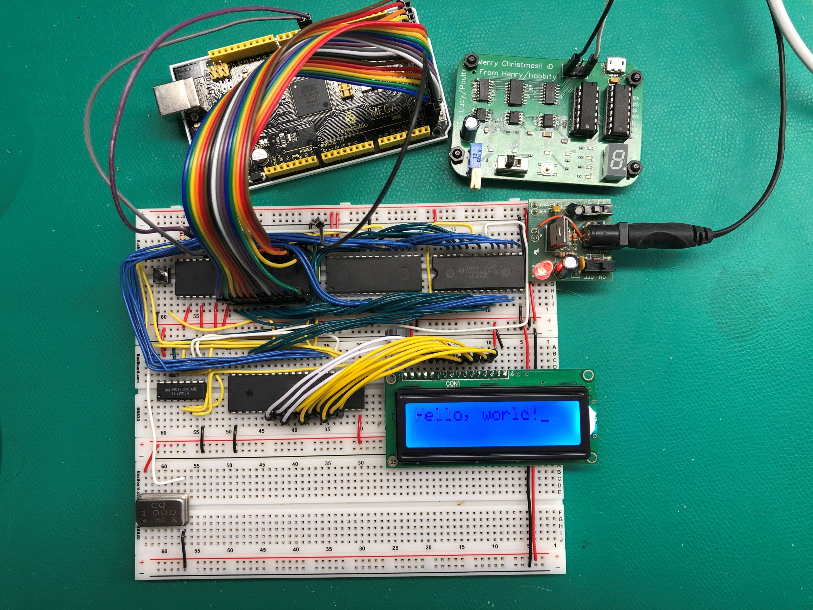

# Build a 6502 computer

Files for my build of Ben Eater's excellent 6502 breadboard computer. More
from him at https://eater.net/6502.

I've slightly modified some of the commands and code to have incremental
versions of some of the programs he iterates on.

## Video 1

There are no commands for [video 1](https://www.youtube.com/watch?v=yl8vPW5hydQ).
All the software is resistors.

## Video 2

Commands for [video 2](https://www.youtube.com/watch?v=yl8vPW5hydQ).

First, the bin with just `ea` values.

    python makerom_ea.py
    hexdump -C rom_ea.bin
    minipro -p AT28C256 -w rom_ea.bin

Now the full binary.

    python makerom.py
    hexdump -C rom.bin
    minipro -p AT28C256 -w rom.bin

## Video 3

Commands for [video 3](https://www.youtube.com/watch?v=oO8_2JJV0B4).

    vasm6502_oldstyle -Fbin -dotdir blink.s
    hexdump -C a.out
    minipro -p AT28C256 -w a.out

## Video 4

Commands for [video 4](https://www.youtube.com/watch?v=oO8_2JJV0B4).

    vasm6502_oldstyle -Fbin -dotdir hello-world_vid04.s
    hexdump -C a.out
    minipro -p AT28C256 -w a.out

## Video 5

Commands for [video 5](https://www.youtube.com/watch?v=xBjQVxVxOxc).

    vasm6502_oldstyle -Fbin -dotdir hello-world_vid05.s
    hexdump -C a.out
    minipro -p AT28C256 -w a.out

## Video 7

Commands for [video 7](https://www.youtube.com/watch?v=omI0MrTWiMU).

    vasm6502_oldstyle -Fbin -dotdir hello-world_vid07.s
    hexdump -C a.out
    minipro -p AT28C256 -w a.out
